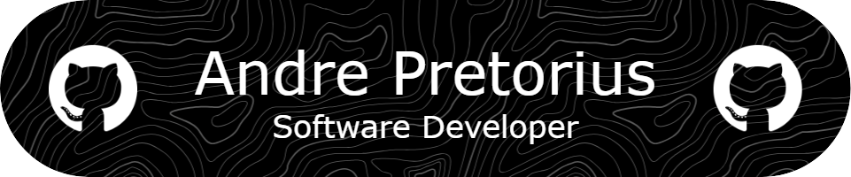
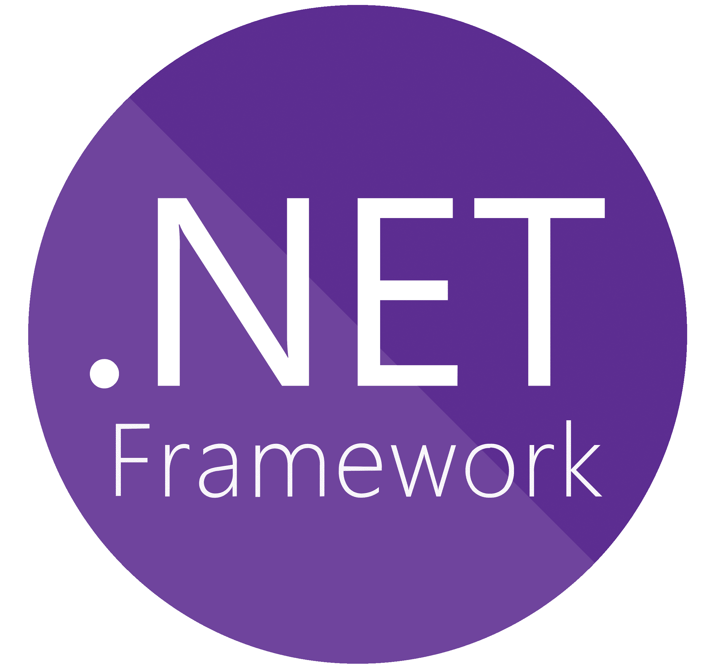

## More About Me
I am currently in my final year of studying a Bachelor of Science degree in Information Technology at the North West University. I have a strong passion for backend development, enjoying the challenge of building efficient and scalable systems.

My primary languages include Python, C#, and Java. I am also currently expanding my skills by learning Go and exploring the world of web development.

Coding has always been a source of excitement for me, and I thrive on solving complex problems and building robust applications. My enthusiasm for technology drives me to constantly learn and adapt to new challenges, ensuring that I stay at the forefront of the ever-evolving tech landscape.

 

## Projects I am currently working on:

- Developing a digital platform as a project for one of my modules, for the Human Movement Sciences School of the North West University. This platform, which includes both a website and a mobile application, is designed to improve accessibility and engagement with the school's resources. The goal is to provide students and faculty with a seamless experience for accessing information, resources, and tools related to human movement sciences.

- Developing the frontend of a website for a small startup company that sells nutritional supplements, based in Windhoek, Namibia. The goal of this project is to provide users with a visually appealing interface to effectively showcase their range of products and enhance the online shopping experience for their customers.

  

 

  
## Languages

| *Python*   | *C#*   | *Golang* | *HTML*   | *CSS*  | *Java* | *SQL*        |
|----------|------------|--------|----------|--------------|------------|------------|
|  |  |  |  |  |  |  |  

  

 

  
## Development Tools

| *Git*   | *Visual Studio* | *VS Code* | Github |
|----------|--------------|------------|---------|
|  |  |  |  |

 

  
## Frameworks

| *.NET*   |
|----------|
|  |

   

 

## Contact Me

<pre>
  <code id="email-command">andrepret4@icloud.com</code>
</pre>

 

## Statistics

 

 

 

  

  

  &nbsp;&nbsp;
  &nbsp;&nbsp;
  &nbsp;&nbsp;
  &nbsp;&nbsp;
  

